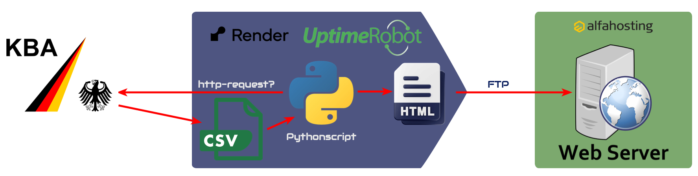

# Aufbereitung von KBA-Statistiken
Aufgrund der Möglichkeit, statistische Daten zu den Neuzulassungen von Fahrzeugen direkt im Statistikportal des KBA abzufragen (https://experience.arcgis.com/experience/4fe31a1cadce449bb27045ca2fafb9d3) entstand die Idee, dass diese (im CSV-Format) abgefragten Daten auch per Skript zu einer HTML-Seite umformatiert werden und automatisch im Wiki des Leapmotor Forums verlinkt werden könnten.

## Umsetzung
Da es noch keinen Automatismus für die Abfrage des Statistikportals gibt, müssen die Daten manuell dort abgefragt, als Detei bereitgestellt, mit dem Skript csv2html.py in ein gültiges HTML-Format umgewandelt und anschliessend auf den Anzeige-Webserver (synvoll.cn) hochgeladen werden.

Die beiden Schritte sind:
- Extrahieren der gewünschten Daten aus dem KBA-Statistikportal und speichern der CSV-Datei auf dem Webserver (synvoll.cn)
- Reformatieren der CSV-Daten mittels Python-Skript und speichern der HTML-Datei auf dem Webserver (synvoll.cn)

## Nutzung
Die generierte HTML-Seite kann dann direkt auf dem Webserver zur Ansicht aufgerufen werden.
