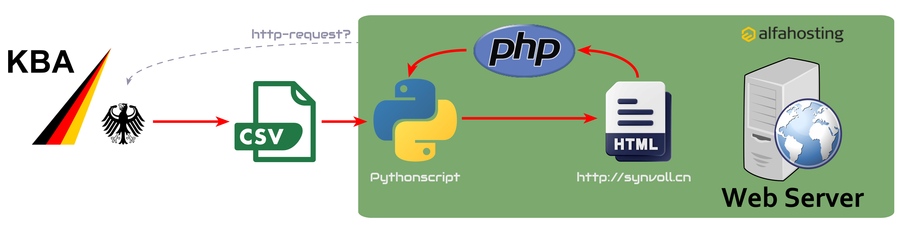

# Aufbereitung von KBA-Statistiken
Aufgrund der Möglichkeit, statistische Daten zu den Neuzulassungen von Fahrzeugen direkt im Statistikportal des KBA abzufragen (https://experience.arcgis.com/experience/4fe31a1cadce449bb27045ca2fafb9d3) entstand die Idee, dass diese (im CSV-Format) abgefragten Daten auch per Skript zu einer HTML-Seite umformatiert werden und automatisch im Wiki des Leapmotor Forums verlinkt werden könnten.

## Umsetzung
Da es noch keinen Automatismus für die Abfrage des Statistikportals gibt, müssen die Daten manuell dort abgefragt, als Detei bereitgestellt und mit dem Webformular umgewandelt werden.



Die beiden Schritte sind:
- Extrahieren der gewünschten Daten aus dem KBA-Statistikportal und lokale Speicherung als CSV-Datei
- Reformatieren und Anzeigen der CSV-Daten mittels Python-App (z.B. http://synvoll.cn/index.php)

## Nutzung
Die HTML-Seite kann direkt auf dem Webserver zur Ansicht (und Bearbeitung) aufgerufen werden.

### PHP-Webseite installieren

Für den PHP-Betrieb werden diese Dateien in das Webverzeichnis hochgeladen:

- `index.php`
- `csv2html.py`

Der Webserver benötigt PHP mit aktivierter `exec()`-Funktion sowie Python 3.6.8. `index.php` ruft `csv2html.py` mit `--input` und `--output` auf. Die CSV und die erzeugte HTML-Datei werden nur temporär gespeichert und danach gelöscht. Das letzte Ergebnis bleibt pro Browser-Session sichtbar.

Falls Python nicht unter `python3` erreichbar ist, in `index.php` die Konstante `PYTHON_BIN` an den Serverpfad anpassen, zum Beispiel:

```php
const PYTHON_BIN = '/usr/bin/python3';
```

Danach `index.php` über die Domain aufrufen, eine CSV-Datei auswählen und das Formular absenden. Die bisherigen Flask-Dateien und `requirements.txt` werden für die PHP-Variante nicht benötigt.
